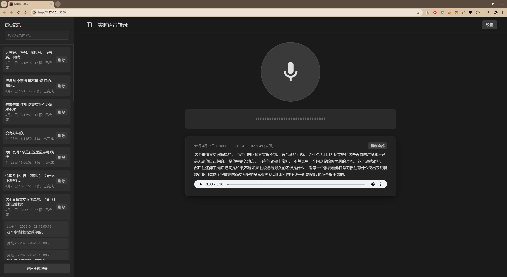

# 实时语音转录工具 (Minimalist Whisper Engine)

### 项目地址
https://github.com/buxuele/flask-read-mic





这是一个追求极致审美与工业级稳定性的实时语音转录系统。它不仅仅是一个 Whisper 的包装壳，而是通过**滑动窗口上下文纠错逻辑**与**高度克制的一体化 UI**，构建了一个流畅、精准、无干扰的转录体验。

## 核心特性

1.  **更懂语境的转录**：采用滑动窗口机制，系统会动态累加音频流并实时比对上下文。在你还没说完一句话时，它已经在后台静默修正了前几秒的识别错误。
2.  **极致克制审美**：
    -   纯正暗色主题，彻底杜绝“科技蓝”渐变。
    -   **西瓜红 (#d9234a)** 三倍大录音按钮，作为视觉指挥核心。
    -   ChatGPT 同款极简侧边栏折叠逻辑，最大化文字展示空间。
3.  **智能历史管理**：
    -   **文本即标题**：侧边栏自动截取转录正文前 20 字作为标题。
    -   **单会话聚焦**：重启录音即自动清场，让主视野永远保持纯净。
4.  **工业级底座**：
    -   基于 `Faster-Whisper` 模型，支持 CUDA 加速。
    -   内置 OpenCC 繁简转换。
    -   自动化 CUDA 环境探测，解决 Windows 下的 DLL 依赖噩梦。

## 技术架构

-   **Backend**: Flask (Python) + SQLite
-   **Inference**: Faster-Whisper (ctranslate2)
-   **Frontend**: Vanilla JS + CSS3 (No Frameworks, No Bloat)
-   **Storage**: 句子级缓冲机制 (Session State)

## 快速启动

### 1. 环境准备
确保您的系统中已安装 Python 3.8+ 以及 NVIDIA 驱动（如果使用 GPU 加速）。

```bash
# 创建并激活虚拟环境
python -m venv venv
source venv/Scripts/activate  # Windows

# 安装核心依赖
pip install -r flask_app/requirements.txt
```

### 2. 模型下载
首次运行会通过 HuggingFace 自动下载模型（推荐开启 GPU 环境）。

### 3. 启动应用
```bash
python flask_app/app.py
```
访问地址：`http://127.0.0.1:5000`

## 快捷键与操作

-   **点击西瓜红大按钮**：开始/停止录音。
-   **侧边栏图标**：收纳/展开历史记录。
-   **复制全部**：原地反馈式的文本提取操作。

---

> “极致的克制，就是最高的效率。”
